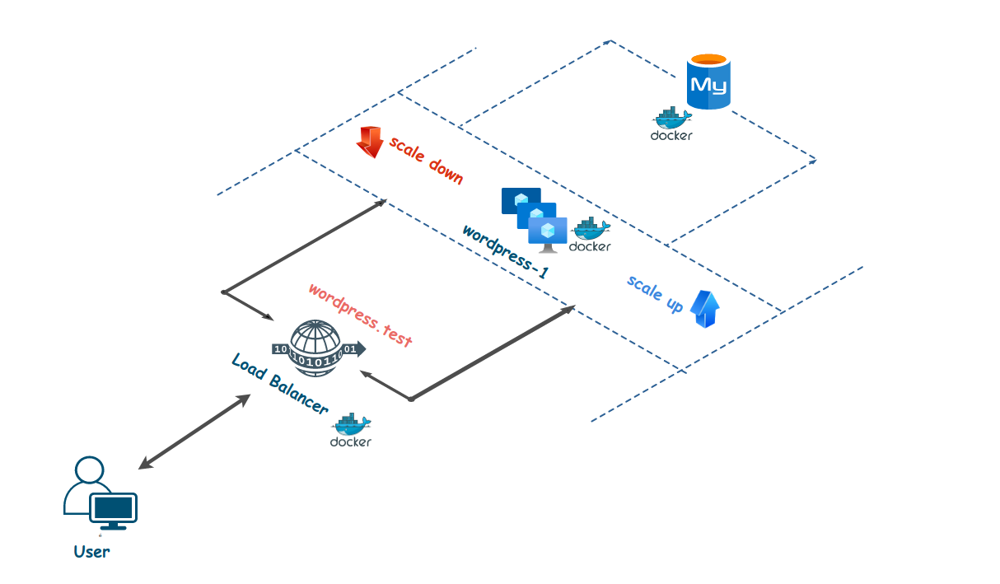

# Deploy wordpress with docker-compose / Vagrant 
## Deploy wordpress with docker-compose

The goal of this first part of this basic project is to deploy a production gradle wordpress application using docker-compose. 

  

### Stack 

The applications will be composed of three services : 
  - Wordpress 
  - Mysql 
  - Load Balancer 

### Docker Images 

It's recommended to use the following image for the application services :
  - worpdress:latest
  - mysql:5.7
  - dockercloud/haproxy

### Final Result 

After running your services Wordpress should run on **http://localhost** :

  

## Deploy wordpress with Vagrant

The goal of this second part of this basic project is to deploy a production gradle wordpress application using Vagrant.

### Stack
the applications will be composed of two services : 
  - apache
  - Wordpress 
  - Mysql

### Steps

to create this project you have to :
  - create a config.yaml file how containe the Vm Config (ip,memory,cpus)
  - create a script.sh file to install/config sql db & wordpress
  - create a Vagrantfile who can read the necessary files to accomplish the installation